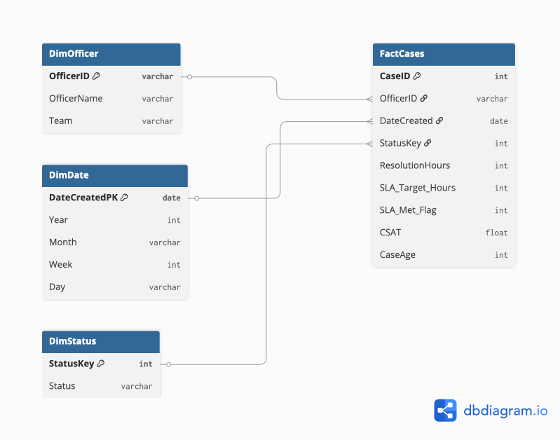

# Performance Data Pipeline

This project demonstrates an end-to-end data workflow using Python, SQL, and Tableau Public to transform customer support data into a star schema and an interactive operational performance dashboard.

**Workflow**

Raw Data → Data Profiling → ETL → Data Modeling (Star Schema) → Dashboard

  

